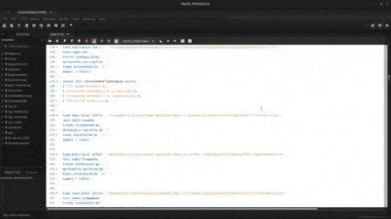

<br />
<div align="center">
  <h1>Database Project</h1>
  <p>
    This repository contains the implementation for the laboratory project of Databases and Information Systems class at the University of Florence
  </p>
  <p align="center">
    
</p>
</div>

<details>
  <summary>Table of Contents</summary>
  <ol>
    <li>
      <a href="#getting-started">Getting Started</a>
    </li>
    <li>
      <a href="#description">Description</a>
      <ul>
        <li><a href="#conceptual-design">Conceptual design</a></li>
        <ul>
          <li><a href="#e-r-diagram">E-R Diagram</a></li>
        </ul>
        <li><a href="#logical-design">Logical design</a></li>
        <ul>
          <li><a href="#restructuring-of-the-e-r-diagram">Restructuring of the E-R diagram</a></li>
          <li><a href="#restructure-e-r-diagram">Restructure E-R diagram</a></li>
        </ul>
      </ul>
    </li>
    <li><a href="#problem">Problem</a></li>
    <li><a href="#running-instructions">Running instructions</a></li>
    <li><a href="#assignment-and-report">Assignment and report</a></li>
    <li><a href="#license">License</a></li>
  </ol>
</details>

# Getting Started
In order to run this [source code](/src/code-project.sql), download MySQL Workbench on the relative [site page](https://dev.mysql.com/downloads/workbench/).
Project tested in MySQL Workbench 8.0.30, installed on Ubuntu Linux 22.04.


# Description 
University project that aims to create a database with related schemes and alleys. Instances are then created to populate that database and visits and triggers are implemented. Follows the implementation of queries such as: selections, projections, joins, with grouping, nested, with functions for flow control. Finally, procedures and functions are implemented.
The idea from which the project takes its cue comes from the course '[Database Systems Concepts & Design](https://www.udacity.com/course/database-systems-concepts-design--ud150) present on Udacity.
The aim of the project is therefore to create a database for a social media X like Linkedin with the related queries, procedures and functions.

# Conceptual design

<p> The project is structured as follow. </p>

Platform X stores users. There are two types of users. Each user must be a user or an admin. All users have a userId, a password, name and surname. An admin also has the date and time of the last access to the platform. A user also has a gender, date of birth, current city and hometown, and multiple interests. The platform stores employers. Each employer has a unique name. A user can be related to many employers, in turn they can be related to many users. In the relationship between a user and an employer, it's possible to store more professional qualifications. A user can also be a freelancer. The platform stores the names of the schools and their type. Each school has a unique name. All schools must have a typology (university, high school, middle school, primary school), which in turn can be the typology of education for multiple schools. A school can have several types of education within it. A user can be related to many schools, which in turn can be related to many users. In the relationships between user and school, it's possible to archive the end of studies date for each year. Each user can send multiple friend requests. A friendship is determined solely by the userId of the user who requested it and the userId of the user who accepted it. Friendship is not always mutual... just because A is a friend of B, this doesn't imply that B is a friend of A.

## E-R Diagram

<p align="center">
    
</p>

# Logical design

## Restructuring of the E-R diagram

Let's replace generalization with associations.
<p align="center">
    
</p>
<p>
  <li>
  A one-to-one relationship is introduced between the parent entity and each child entity.
  </li>
  <li>
  You enter the constraint that for each instance of the parent entity can only participate in one bonding relationship with the child entities.
  </li>
  <li>
  Since the generalization is total, each instance of the parent entity participates in only one of the bonding relationships with the children.
  </li>
</p>

<p>
  <p align="center">
  
  </p>
  <li>
    The two subtypes have specific attributes.
  </li>
  
  <li>
    We leave the two subtypes with entities and use two relationships to avoid having entities with too many attributes and/or with attributes with null values.
  </li>
</p>

## Restructure E-R diagram

<p align="center">
  
</p>


# Probelm
When using MySQL Workbench 8 there's an error when using the command 'load data local infile', due to restrictions on file access permissions. The problem can be solved by consulting the following page of [stackoverflow](https://stackoverflow.com/a/64807264).

<p>For the sake of completeness, the solution to the problem is also reported below.
</p>
<p>Open MySQL Workbench → go to Settings → Connection → Advanced → Others
 <li>Add the string:</li>

 ```diff
  OPT_LOCAL_INFILE = 1;
  ```
</p>
<p align="center">
  
</p>

# Running instructions
Open a MySQL Workbench session and copy the contents of the [code-project.sql](\src\code-project.sql) file.

After copying all the contents of the file it's necessary to scroll the file up to the comment 'Instance creation: database population'.

At this point it's necessary to change for each command 'load data local infile', the path of all csv file in relation to where they have been saved on the computer.
<p>
For example for Unix:

```diff
load data local infile '~/database-project/res/cvs/nameFile.csv'
```

'~' stands for /home/userName/
</p>

<!---
<p>
For example for Windows:

```diff
load data local infile 'C:/Users/userName/database-project/res/cvs/nameFile.csv'
```

</p>
-->

<p>
After changing the paths for all the CSV files, all you have to do is press the lightning icon to run the program on the top left.
</p>


# Assignment and report

You can have a look at the written [report](doc/Report.pdf), but beware that they have been written in Italian.
While all the source code is commented in English.

# License

Distributed under the GNU General Public License v3.0 . See [LICENSE.txt](LICENSE) for more information.
